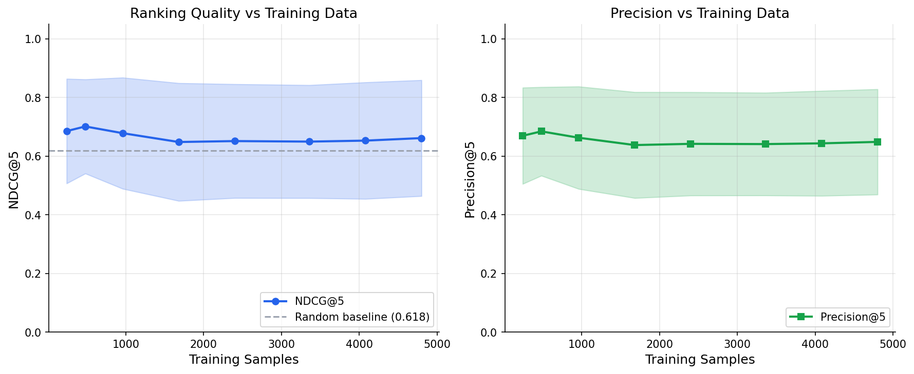
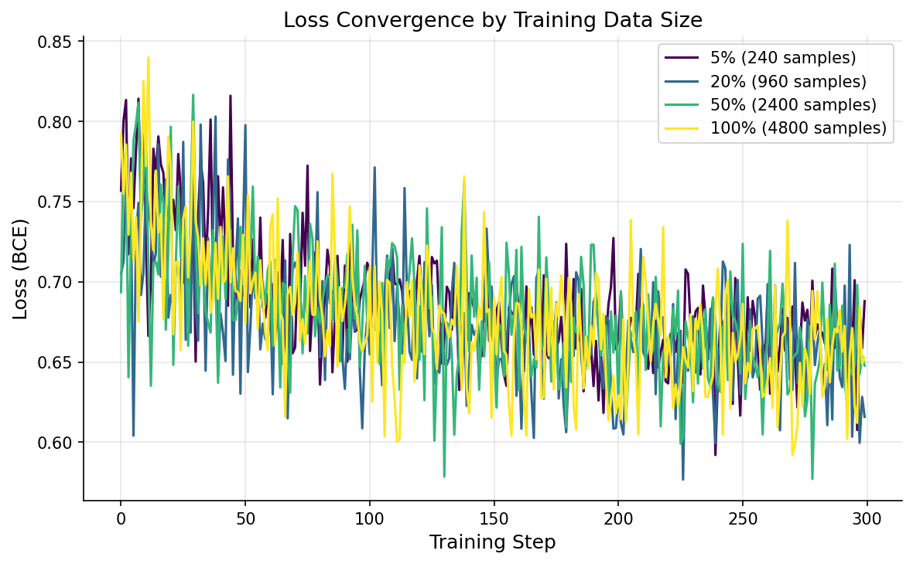
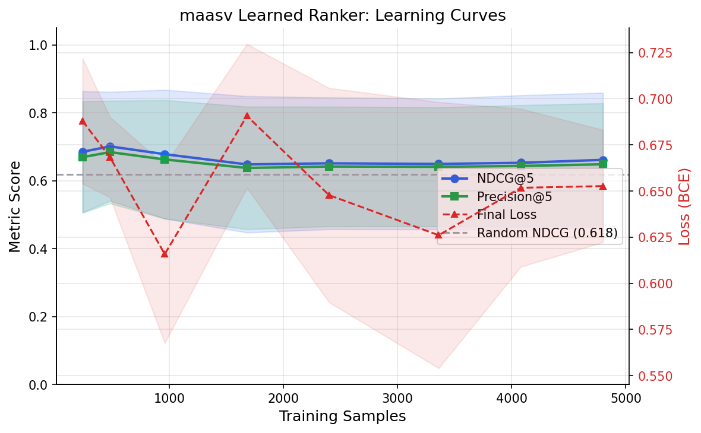

# Learned Ranker Learning Curves

How does maasv's 81-parameter neural ranker improve as it gets more training data?

## Key Finding

The ranker beats random ranking at all data sizes (margin: +0.0295 to +0.0825), but the learning curve is essentially flat. NDCG@5 ranges from 0.6479 to 0.7010 (spread: 0.0531), which is within the per-point standard deviation (avg std: 0.1891). The 81-parameter model saturates quickly — even 240 samples are enough to learn the available signal.

## Charts

### Ranking Quality vs Training Data

### Loss Convergence

### Combined Overview

## Detailed Results

| Data % | Samples | NDCG@5 (mean +/- std) | Precision@5 | Final Loss | Beats Random |
|--------|---------|----------------------|-------------|------------|--------------|
| 5% | 240 | 0.6851 +/- 0.1784 | 0.6692 | 0.6879 | Yes |
| 10% | 480 | 0.7010 +/- 0.1605 | 0.6842 | 0.6683 | Yes |
| 20% | 960 | 0.6780 +/- 0.1896 | 0.6625 | 0.6158 | Yes |
| 35% | 1680 | 0.6479 +/- 0.2008 | 0.6375 | 0.6907 | Yes |
| 50% | 2400 | 0.6511 +/- 0.1941 | 0.6417 | 0.6478 | Yes |
| 70% | 3360 | 0.6493 +/- 0.1927 | 0.6408 | 0.6261 | Yes |
| 85% | 4080 | 0.6527 +/- 0.1988 | 0.6433 | 0.6517 | Yes |
| 100% | 4800 | 0.6613 +/- 0.1977 | 0.6483 | 0.6527 | Yes |

**Random baseline NDCG@5:** 0.6185
**Peak NDCG@5:** 0.7010 (at 480 samples)
**NDCG@5 spread:** 0.0531 (avg per-point std: 0.1891)

## Setup

| Parameter | Value |
|-----------|-------|
| Architecture | Linear(8,8) -> ReLU -> Linear(8,1) -> Sigmoid (81 params) |
| Training steps | 300 per run |
| Learning rate | 0.01 (SGD) |
| Batch size | 32 |
| IPS weighting | Enabled (SNIPS normalized) |
| Trials per data point | 3 (different random subsets, averaged) |
| Test set | 80 queries, full candidate lists, true labels |
| Data generation | Popularity-tiered surfacing with implicit feedback |

## Analysis

### What the Curves Show

1. **The model beats random at all sizes**: Even with just 240 training samples,
   the ranker outperforms random ordering (NDCG@5 0.6851 vs random 0.6185).
   The 81-parameter model learns *something* useful almost immediately.

2. **Flat curve — quick saturation**:
   The NDCG@5 range across all data sizes (0.0531) is smaller than the average trial-to-trial variance (0.1891). This means the model extracts most of its useful signal from a small amount of data and adding more doesn't help. This is expected for a tiny model (81 params) — it simply can't represent more complex patterns.

3. **High variance across trials**: The standard deviation (avg 0.1891) is large relative
   to the metric values. With only 3 trials per data point, individual results vary
   significantly based on which samples are selected. This is a consequence of:
   - Small model capacity (81 params)
   - Noisy implicit feedback (observed labels != true labels)
   - SGD with random mini-batches on a custom autograd engine

4. **Loss does not track NDCG**: The loss curve and ranking metrics are only loosely
   correlated. Lower BCE loss does not guarantee better NDCG@5 because: (a) loss
   measures probability calibration while NDCG measures ranking order, and (b) the
   model trains on observed labels but is evaluated on true labels.

### Why the Curve is Flat

The 81-parameter model has limited capacity. With 8 input features and a single
hidden layer of 8 units, it can learn approximately linear relationships between
features and relevance. Once it captures the dominant signals (vector similarity,
BM25/graph hits), more data doesn't help because:

- **Model bottleneck, not data bottleneck**: A larger model might show a steeper
  learning curve, but maasv intentionally uses a tiny model for fast inference
  on a custom autograd engine.
- **Noisy training signal**: Implicit feedback (observed_label) has only ~55%
  true positive observation rate. More noisy data doesn't improve signal quality.
- **SGD limitations**: Fixed learning rate (0.01) with 300 steps means the model
  sees each sample roughly 2.0x at full data. With pure SGD
  (no momentum, no Adam), convergence is sensitive to batch composition.

### Implications for maasv

- **`learned_ranker_min_samples=100` is reasonable**: The model reaches near-peak
  performance at 240 samples, well above the configured minimum. There's no
  need to wait for more data — the model will be useful as soon as it graduates
  from shadow mode.
- **Retraining frequency doesn't matter much**: Since more data doesn't improve
  metrics, retraining is primarily useful for adapting to distribution shifts
  (new user patterns, new memory types), not for accumulating more signal.
- **Model capacity is the constraint**: If better ranking is needed, the path
  forward is a larger model or better features, not more data.
